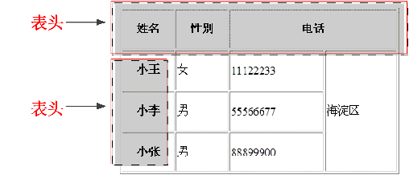
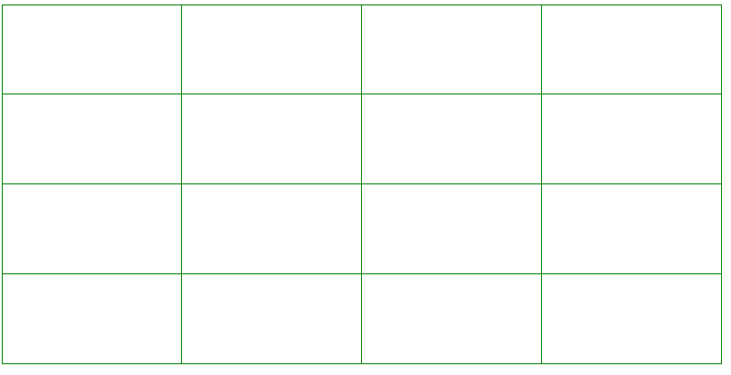

# HTML基础(一)
## 一、纯文本和HTML

### 1.1.纯文本

最简单的纯文本就是记事本，扩展名.txt。
纯文本文件只能保存文本内容不能保存文本格式，文件大小远远小于Word文档。
word文档不但可以保存文本内容，还可以保存文本格式，文件大小远大于.txt文档。
html  css  js都是纯文本文件可以用任何文本编辑器进行

### 1.2.html

html（hypertext markup language）超文本标记语言

**作用：控制文本语义** 样式不是html作用，而是css作用。

> 超文本：用文本来标记文本，用的这个文本就是超文本。
>
> 特点：超文本不会在浏览器中渲染超文本标记文本语义。人类说的语言多有语义，比如标题，段落。
>
> 超文本（标签）：给文本添加语义，不会更改样式。


## 二、html骨架

### 2.1.基本骨架

```html
<html>
  <head>
      <meta charset="UTF-8">
      <title>网页标题</title>
  </head>
  <body>
      <h1>正文标题</h1>
      <p>文本</p>
  </body>
</html>
```

head标签：内部书写html文件一些配置信息

body标签：网页主体部分，渲染在浏览器页面中

[基本骨架示例](../code/1.HTML基础/1.1HTML基础(一)/1.html骨架.html)

### 2.2.DTD

DTD：文档类型定义（document type definition）

**作用：规定html书写的哪一个版本规范。**

两种声明方法：

**内部声明**：\<!DOCTYPE 根元素[元素声明]>

```html 
<!DOCTYPE html>
```

**外部声明：**\<!DOCTYPE 根元素 类型 文件名>

```html
1	<!DOCTYPE html PUBLIC "-//W3C//DTD XHTML 1.0 Transitional//EN" "http://www.w3.org/TR/xhtml1/DTD/xhtml1-transitional.dtd">
```

Xhtml1.0版本

> xhtml要求所有标签都必须使用小写字母，标签的属性值必须使用双引号包裹，结束标签必须书写关闭符号。

html4.01版本

> 规范做了扩展升级,结构和样式做了分离。

**html4.01和 xhtml1.0还具体规定了3小规范:**

- **strict:** 严格版本，不能使用框架集，不能使用废弃标签
- **transitional:** 通用版本，不能使用框架集，可以使用废弃标签
- **frameset:** 框架集版本，可以使用框架集。


超文本标记语言
超文本：超链接（实现页面跳转）

## 1.HTML结构标准

```HTML
<!DOCTYPE html>   <!-- 声明文档类型 -->
<html lang="en" dir="ltr">  <!-- 根标签 -->
  <head>  <!-- 头标签 -->
    <meta charset="utf-8">  <!-- 定义网页展示内容的编码 -->
    <title></title> 标题标签
  </head>
  <body>  <!-- 主体标签 -->

  </body>
</html>
```


## 2.HTML标签分类

- `单标签   <! Doctype html>`
- `双标签   <html></html>   <head></head>   <title></title>`


## 3.Html标签关系分类

- `包含（嵌套关系）  <head><title></title></head>     父子`
-  `并列关系       <head></head><body></body>     兄弟姐妹`


## 4.标签

### 4.1 单标签

- 注释标签
```HTML
<!-- 这是注释 -->
```
- 换行标签
```HTML
<br/>
```
- 水平线标签
>说明：在网页中常常看到一些水平线将段落与段落之间隔开，使得文档结构清晰，层次分明。这些水平线可以通过插入图片实现，也可以简单地通过标记来完成，< hr/>就是创建横跨网页水平线的标记。其基本语法格式如下：
< hr/>是单标记，在网页中输入一个< hr/>，就添加了一条默认样式的水平线。

```HTML
<hr/>
```


### 4.2 双标签

- 文本内容标签
>说明：在网页中要把文字有条理地显示出来，离不开段落标记，就如同我们平常写文章一样，整个网页也可以分为若干个段落，而段落的标记就是< p>。< p>是HTML文档中最常见的标记，默认情况下，文本在一个段落中会根据浏览器窗口的大小自动换行。

```HTML
<p>文本内容标签</p>
```

**特点：上下自动生成空白。\<br>不会生成空白行**


- 标题标签
>说明为了使网页更具有语义化，我们经常会在页面中用到标题标记，HTML提供了6个等级的标题，即< h1>、< h2>、< h3>、< h4>、< h5>和< h6>，从< h1>到< h6>重要性递减。

```HTML
<h1>标题1</h1>
...
<h6>标题6</h6>  <!-- 最多取值到h6 -->
```
**注意：h1在一个页面里只能出现1次，应为seo只会读取h1标签来判断权重**


- 文本样式标签
> 说明：多种多样的文字效果可以使网页变得更加绚丽，为此HTML提供了文本样式标记<font>，用来控制网页中文本的字体、字号和颜色。

```HTML
<font>文本标签</font>
```


- 文本格式化标签

|标记	|显示效果|
|:---|:---|
|< b>< /b>和< strong>< /strong>|	文字以粗体方式显示（XHTML推荐使用strong）|
|< i>< /i>和< em>< /em>	|文字以斜体方式显示（XHTML推荐使用em）|
|< s>< /s>和< del>< /del>|	文字以加删除线方式显示（XHTML推荐使用del）|
|< u>< /u>和< ins>< /ins>|	文字以加下划线方式显示（XHTML不赞成使用u）|
    - 文本加粗标签
        ```HTML
        <strong>文本加粗标签</strong>
        <b>同strong作用</b>
        ```
    - 文本倾斜标签
        ```Html
          <em>文本倾斜标签</em>
          <i>同em作用</i>
        ```
    - 删除线标签
        ```Html
           <del>删除线标签</del>
           <s>同del作用</s>
        ```
    - 下划线标签
        ```HTML
          <ins>下划线标签</ins>
          <u>同上ins作用</u>
        ```


### 4.3 图片标签

HTML网页中任何元素的实现都要依靠HTML标记，要想在网页中显示图像就需要使用图像标记，接下来将详细介绍图像标记< img/>以及和他相关的属性

```HTML

```
|属性|	属性值|	描述|
|:---:|:---:|:---:|
|src	|URL	|图像的路径|
|alt	|文本|	图像不能显示时的替换文本|
|title|	文本|	鼠标悬停时显示的内容|
|width|	像素（XHTML不支持%页面百分比）|	设置图像的宽度|
|height|	像素（XHTML不支持%页面百分比）|	设置图像的高度|

**◆** 图片没有定义宽高的时候，图片按照百分之百比例显示，如果只更改图片的宽度或者高度，图片等比例缩放。


## 5. 路径

### 5.1 相对路径

相对路径不带有盘符，通常是以HTML网页文件为起点，通过层级关系描述目标图像的位置。
相对路径设置分为以下三种：
- 图像文件和html文件位于同一文件夹：只需输入图像文件的名称即可，如< img src="logo.gif" />。

- 图像文件位于html文件的下一级文件夹：输入文件夹名和文件名，之间用“/”隔开，如< img src="img/img01/logo.gif" />。

- 图像文件位于html文件的上一级文件夹：在文件名之前加入“../” ，如果是上两级，则需要使用 “../ ../”，以此类推，如< img src="../logo.gif" />。


### 5.2 绝对路径

绝对路径一般是指带有盘符的路径


## 6. 超链接

```HTML
<a href="" title="" target=""></a>
```
|属性|描述|
|:---:|:---:|
|href|   去往的路径（跳转的页面） 必写属性|
|title |   提示文本   鼠标放到链接上显示的文字|
|target=”_self”|    默认值    在自身页面打开（关闭自身页面，打开链接页面） |
|target=”_blank”|   打开新页面 （自身页面不关闭，打开一个新的链接页面|

**注意:**
暂时没有确定链接目标时，通常将< a>标记的href属性值定义为“#”(即href="#")，表示该链接暂时为一个空链接。不仅可以创建文本超链接，在网页中各种网页元素，如图像、表格、音频、视频等都可以添加超链接。

- 锚链接
通过创建锚点链接，用户能够快速定位到目标内容。
创建锚点链接分为两步：
  1. 使用< a href=”#id名“>链接文本</a>创建链接文本。
  2. 使用相应的id名标注跳转目标的位置。
```HTML
<!-- 1.先定义一个锚点 -->
<p id="sd"></p>
<!-- 2. 超链接到锚点 -->
<a href="#sd">超链接到锚点</a>
```
- 空链  不知道链接到那个页面的时候，用空链
```HTML
<a href="#">空链</a>
```
- 压缩文件下载  不推荐使用
```HTML
<a href="./xxx.rar">压缩包</a>
```
- 超链接优化写法
```HTML
<base target="_blank">   让所有的超链接都在新窗口打开
```


## 7.特殊符号标记

|特殊字符|描述|字符的代码|
|:---:|:---:|:---|
| |空格符| \&nbsp;|
|<|小于号|	\&lt;|
|>|大于号|	\&gt;|
|&|和号	|\&amp;|
|￥|人民币|	\&yen;|
|©|	版权|\&copy;|
|®|	注册商标|\&reg;|
|°|	摄氏度|\&deg;|
|±|	正负号|\&plusmn;|
|×|	乘号|\&times;|
|÷|	除号|\&divide;|
|²|	平方2（上标2）|	\&sup2;|
|³|	立方3（上标3）|	\&sup3;|


## 8.列表

### 无序列表
无序列表的各个列表项之间没有顺序级别之分，是并列的。其基本语法格式如下：
```HTML
<ul type="">
  <li>1</li>
  <li>2</li>
  <li>3</li>
  <li>4</li>
  <li>5</li>
</ul>
```
在上面的语法中，< ul>< /ul>标记用于定义无序列表，< li>< /li>标记嵌套在< ul>< /ul>标记中，用于描述具体的列表项，每对< ul>< /ul>中至少应包含一对< li>< /li>。
无序列表中type属性的常用值有三个，它们呈现的效果不同.
- type=”square”      小方块
- Type=”disc”       实心小圆圈
- Type=”circle”      空心小圆圈


### 有序列表

有序列表即为有排列顺序的列表，其各个列表项按照一定的顺序排列定义，有序列表的基本语法格式如下：
```HTML
<ol>
  <li>1</li>
  <li>2</li>
  <li>3</li>
  <li>4</li>
  <li>5</li>
</ol>
```
在上面的语法中，< ol>< /ol>标记用于定义有序列表，< li>< /li>为具体的列表项，和无序列表类似，每对< ol>< /ol>中也至少应包含一对< li>< /li>。
有序列表其他属性  type   start
语法格式：
```HTML
<ol type=value1 start=value2>
  <li></li>
</ol>
```
value1表示有序列表项目符号的类型, value2表示项目开始的数值. start是编号开始的数字，如start=2则编号从2开始，如果从1开始可以省略，或是在< li>标签中设定value＝"n"改变列表行项目的特定编号，例如< li value="7">。type=用于编号的数字,字母等的类型，如type=a，则编号用英文字母。使用这些属性，把它们放在< ol>或< li>的的初始标签中

Type属性如下图
|type类型|	        描述|
|:---:|:---:|
|Type=1|	表示列表项目用数字表示（1,2,3…..）|
|Type=a|	表示列表项目用小写字母表示(a,b,c..)|
|Type=A|	表示列表项目用大写字母表示(A,B,C..)|
|Type=i|	表示列表项目用小写罗马数字表示(i,ii,iii….)|
|Type=I|	表示列表项目用大写罗马数字表示(I,II,III…)|

一般type的设置同样在css中设置


### 自定义列表
定义列表常用于对术语或名词进行解释和描述，定义列表的列表项前没有任何项目符号。其基本语法如下：
```HTML
<dl>
  <dt>小标题</dt>
  <dd>解释标题1</dd>
  <dd>解释标题2</dd>
</dl>

```


## 9.音乐标签

```HTML
<embed type="video/quicktime" src="#" width="300" height="300">
```


## 10.Meta标签介绍

meta 的属性有两种：name和http- equiv

name属性主要用于描述网页，对应于content（网页内容）


### 10.1 \<meta charset="UTF-8">编码字符集

```HTML
<!-- 编码字符集 -->
<meta charset="UTF-8">
```


### 10.2 \<meta name="KEYWords" contect="">关键词

作用：向搜索引擎说明你的网页的关键词；
```HTML
<meta name="keywords" content="前端学习"，“html5学习”，“在线学习”>
```


### 10.3 \<meta name="description" contect="">网页描述

作用：告诉搜索引擎你的站点的主要内容；
```HTML
<meta name="DEscription" contect="这个网页用于网页描述">
```


### 10.4 \<meta name="Generator" contect="">说明生成工具

作用：用以说明生成工具
```HTML
<meta name="generator" content="Microsoft FrontPage 4.0">
```


### 10.5 \<meta  name="Author"  contect="">制作的作者

作用：告诉搜索引擎你的站点的制作的作者
```HTML
<meta name="author" content="toby">
```


### 10.6 \<meta name="Robots" contect= "all">爬虫规则

作用：设置爬虫规则
```HTML
<meta name="Robots" content="all|none|index|noindex|follow|nofollow">
```
其中的属性说明如下：
- 设定为all：文件将被检索，且页面上的链接可以被查询；
- 设定为none：文件将不被检索，且页面上的链接不可以被查询；
- 设定为index：文件将被检索；
- 设定为follow：页面上的链接可以被查询；
- 设定为noindex：文件将不被检索，但页面上的链接可以被查询；
- 设定为nofollow：文件将不被检索，页面上的链接可以被查询。


### 10.7 \<meta http-equiv="Refresh" content="时间;网页名称">网页重定向

作用：设置多少秒内网页重定向
```HTML
<meta name="Refresh" content="5;http://www.baidu.com">
```


### 10.8 \<link rel="stylesheet" href="位置"> 链接外部样式表

作用：链接外部样式表
```HTML
<link rel="stylesheet" href="/css/master.css">
```


### 10.9 \<link rel="icon" href="位置"> 网页小图标

作用：链接网页小图标
```HTML
<link rel="icon" href="favicon.ico">
```


## 11.HTML表格

### 11.1 \<table>

\<table>...\</table>标签用于在HTML文档中创建表格。它包含表名和表格本身内容的代码。表格的基本单元是单元格，用\<td>...\</td>标签定义。


### 11.2\<tr>
表格行用\<tr>标签定义，由单元格构成。多个行结合在一起就构成一个表格，这反映在用于创建表格的HTML语法中。表格的每一行都用\<tr>标签表示，并用相应的\</tr> 结束。


### 11.3 \<td>
表格的每一行又有若干表格单元格，用\<td>...\</td>标签表示。TD是"表格数据( Table Data)”的英文缩写。\<td>标签定义一个列，嵌套于<tr>标签内。
border属性是最常用的属性，可用于定义表格的单元格和结构。该属性指定边框的厚度，如果其值设置为零(0)，则不显示边框。


### 11.4 创建表格的基本语法：
```HTML
<table>
  <tr>
    <td>单元格内容</td>
  </tr>
</table>
```
创建表格时，一般情况下分3步：
- 第一步：创建表格标签\< table>…\</table>。
- 第二步：在表格标签\<table>…\</table>里创建行标签\<tr>...\</tr>，可以有多行。
- 第三步：在行标签\<tr>...\</tr>里创建单元格标签\<td>...\</td>，可以有多个单元格。


### 11.5 创建表格的标准语法：
在使用表格进行布局时，可以将表格划分为头部、主体和页脚，具体 如下所示：
- \<thead>\</thead>：用于定义表格的头部，必须位于\<table>\</table>标记中，一般包含网页的logo和导航等头部信息。
- \<tfoot>\</ tfoot >：用于定义表格的页脚，位于\<table>\</table>标记中\<thead>\</thead>标记之后，一般包含网页底部的企业信息等。
- \<tbody>\</tbody>：用于定义表格的主体，位于\<table>\</table>标记中\<tfoot>\</ tfoot >标记之后，一般包含网页中除头部和底部之外的其他内容。
```HTML
<table>
  <thead> <!-- 头部 -->
    <tr>
      <td></td>
    </tr>
  </thead>
  <tbody> <!-- 内容 -->
    <tr>
      <td></td>
    </tr>
  </tbody>
  <tfoot> <!-- 尾部 -->
    <tr>
      <td></td>
    </tr>
  </tfoot>
</table>
```
快速添加表格
table>tr\*行数>td\*列数 + tab


### 11.6 表格中的属性
|属性名|	含义|	常用属性值|
|:---:|:---:|:---:|
|Border|	设置边框 默认为0 没有边框|	单位为px  像素值|
|Cellspacing|	设置单元格与单元格之间的距离|	单位为px 像素值 默认2px|
|Cellpadding|	设置文字与单元格之间的距离	|默认1px|
|Width|	设置表格的宽度|	单位px|
|Height|	设置表格高度|	单位px|
|Align|	设置表格在网页中的对齐方式|	Left左 Right右 Center居中|
|bgcolor|	设置背景颜色|	white ,red,green|
|bordercolor| 设置边框线的颜色 | white ,red,green |


### 11.7 表头
caption 元素定义表格标题
caption 标签必须紧随 table 标签之后。您只能对每个表格定义一个标题。通常这个标题会被居中于表格之上。
```HTML
<table>
  <caption>表头</caption>
  <tr>
    <td></td>
  </tr>
</table>
```


### 11.8 合并单元格

colspan=”行数”  合并同一行上的单元格
rowspan=”列数”  合并同一列上的单元格

```HTML
<table border="1" align="Center" width="500" height="300" cellspacing="0" cellspadding="10">
  <caption>表单</caption>
  <tr>
    <td>姓名</td>
    <td>性别</td>
    <td>年龄</td>
    <td colspan="3">职位</td>
  </tr>
  <tr>
    <td>张三</td>
    <td>男</td>
    <td>11</td>
    <td rowspan="2">前端工程师</td>
  </tr>
  <tr>
    <td>李四</td>
    <td>女</td>
    <td>18</td>
  </tr>
</table>
```


### 11.9表格标题、边框颜色、内容垂直对齐

\<th>标记及其属性
表头一般位于表格的第一行或第一列，其文本加粗居中，如下图所示，即为设置了表头的表格。设置表头非常简单，只需用表头标记\<th>\</th>替代相应的单元格标记\<td>\</td>即可。


```HTML
<tr>
  <th>姓名</th>
  <th>性别</th>
  <th>年龄</th>
</tr>
```
边框颜色bordercolor：
```HTML
  <table border="1" width="500" height="300" cellspacing="0" bordercolor="red">
```
内容垂直对齐 valign:
```HTML
<tr>
  <td valign="top">李四</td>
  <td valign="middle">女</td>
  <td valign="bottom">19</td>
</tr>
```
- 上部：top
- 居中：middle
- 下部：bottom


### 11.10 练习制作细线表格

**注意：表格默认的线宽是2px，要做到1px必须按照以下方法来制作**


```HTML
<!DOCTYPE html>
<html lang="en" dir="ltr">
  <head>
    <meta charset="utf-8">
    <title></title>
  </head>
  <body>
    <table width="500" height="300" bgcolor="green" cellspacing="1">
      <tr bgcolor="white">
        <td></td>
        <td></td>
        <td></td>
        <td></td>
      </tr>
      <tr bgcolor="white">
        <td></td>
        <td></td>
        <td></td>
        <td></td>
      </tr>
      <tr bgcolor="white">
        <td></td>
        <td></td>
        <td></td>
        <td></td>
      </tr>
      <tr bgcolor="white">
        <td></td>
        <td></td>
        <td></td>
        <td></td>
      </tr>
    </table>
  </body>
</html>
```


## 12.表单from

表单的作用是收集信息

语法：
```HTML
<form class="" action="index.html" method="post">

</form>
```
- Name ：定义表单的名称
- Method: 定义表单结果从浏览器传送到服务器的方式，默认参数为：get ；
- Action ：用来指定表单处理程序的位置(服务器端脚本处理程序） 
- Fieldset：把表单分组
- Legend：分组名称


### 12.1 input控件

语法：
在上面的语法中，\<input />标记为单标记，type属性为其最基本的属性，其取值有多种，用于指定不同的控件类型。除了type属性之外，\<input />标记还可以定义很多其他的属性，其常用属性如下表所示。

```HTML
<input  type=“控件类型”>
```
  <table border="0" Cellpadding="0" Cellspacing="1" Width="500" Height="300" Align="center" bgcolor="black">
    <tr bgcolor="white">
      <th>属性</th>
      <th>属性值</th>
      <th>描述</th>
    </tr>
    <tr bgcolor="white">
      <td rowspan="16">type</td>
      <td>text</td>
      <td>单行文本密码框</td>
    </tr>
    <tr bgcolor="white">
      <td>password</td>
      <td>密码框</td>
    </tr>
    <tr bgcolor="white">
      <td>radio</td>
      <td>单选按钮</td>
    </tr>
    <tr bgcolor="white">
      <td>checkbox</td>
      <td>复选框</td>
    </tr>
    <tr bgcolor="white">
      <td>button</td>
      <td>普通按钮</td>
    </tr>
    <tr bgcolor="white">
      <td>submit</td>
      <td>提交按钮</td>
    </tr>
    <tr bgcolor="white">
      <td>reset</td>
      <td>重置按钮</td>
    </tr>
    <tr bgcolor="white">
      <td>image</td>
      <td>图像形式提交按钮</td>
    </tr>
    <tr bgcolor="white">
      <td>hidden</td>
      <td>隐藏域</td>
    </tr>
    <tr bgcolor="white">
      <td>file</td>
      <td>文件域</td>
    </tr>
    <tr bgcolor="white">
      <td>url</td>
      <td>网址控件</td>
    </tr>
    <tr bgcolor="white">
      <td>date</td>
      <td>日期控件</td>
    </tr>
    <tr bgcolor="white">
      <td>time</td>
      <td>时间控件</td>
    </tr>
    <tr bgcolor="white">
      <td>email</td>
      <td>邮件控件</td>
    </tr>
    <tr bgcolor="white">
      <td>number</td>
      <td>数字控件</td>
    </tr>
    <tr bgcolor="white">
      <td>range</td>
      <td>滑块控件</td>
    </tr>
    <tr bgcolor="white">
      <td>name</td>
      <td>由用户自定义</td>
      <td>控件的名称</td>
    </tr>
    <tr bgcolor="white">
      <td>value</td>
      <td>由用户自定义</td>
      <td>input控件中默认的文本值</td>
    </tr>
    <tr bgcolor="white">
      <td>size</td>
      <td>正整数</td>
      <td>input控件中在页面中显示的宽度</td>
    </tr>
    <tr bgcolor="white">
      <td>readonly</td>
      <td>readonly</td>
      <td>该空间内容为只读</td>
    </tr>
    <tr bgcolor="white">
      <td>disable</td>
      <td>disable</td>
      <td>第一次加载页面时禁用该控件</td>
    </tr>
    <tr bgcolor="white">
      <td>checked</td>
      <td>checked</td>
      <td>定义选择控件默认被选择的项</td>
    </tr>
    <tr bgcolor="white">
      <td>maxlength</td>
      <td>正整数</td>
      <td>控件允许输入的最多字符数</td>
    </tr>
  </table>

```HTML
<input type="text" name="username" value=“前端” maxlength="6" readonly="readonly" disabled="disabled">
```

#### 文本输入框 text

```HTML
<input type="text" name="username" value=“前端” maxlength="6" readonly="readonly" disabled="disabled">
```
- maxlength="6"    限制输入字符长度
- readonly=”readonly”  将输入框设置为只读状态（不能编辑）
- disabled="disabled"  输入框未激活状态
- name="username"   输入框的名称
- value="大前端"     将输入框的内容传给处理文件


#### 密码输入框 password

```HTML
<input type="password" name="pwd">
```
**注意：文本输入框的所有属性对密码输入框都有效。**


#### 单选框 radio

```HTML
<input type="radio" name="gender">男
```
**★只有将name的值设置相同的时候，才能实现单选效果。**
**★checked=”checked” 设置默认选择项。**


#### 上传 file

```HTML
<input type="file" name="" value="">
```


#### 文件提交 submit

```HTML
<input type="submit" name="" value="">
```
**★：可以实现信息提交功能**


#### 普通按钮 button

```HTML
<input type="button" name="" value="普通按钮">
```
**★不能提交信息，配合JS使用。**


#### 图片按钮 image

```HTML
<input type="image" src="">
```
**★图片按钮可实现信息提交功能**


#### 重置按钮 reset

```HTML
<input type="reset">
```
**★将信息重置到默认状态**


#### 多选框 checkbox

```HTML
<input type="checkbox" name="" value="">
```
**Checked=”checked” 设置默认选中项**


### 12.2 textarea控件

如果需要输入大量的信息，就需要用到\<textarea>\</textarea>标记。通过textarea控件可以轻松地创建多行文本输入框，其基本语法格式如下：
语法：

```HTML
<textarea cols="每行中的字符数" rows="显示的行数">
       文本内容
</textarea>
```
- Cols:相当于宽度
- Rows:相当于高度


### 12.3 select控件

```HTML
<select>
        <option>选项1</option>
        <option>选项2</option>
        <option>选项3</option>
       ...
    </select>
```

值得一提的是，在HTML中，可以为\<select>和\<option>标记定义属性，以改变下拉菜单的外观显示效果，具体如下表所示。
  <table border="0" Cellpadding="0" Cellspacing="1" Width="500" Height="300" Align="center" bgcolor="black">
    <tr bgcolor="white">
      <th>标记名</th>
      <th>常用属性</th>
      <th>描述</th>
    </tr>
    <tr bgcolor="white">
      <td rowspan="2">&ltselect&gt</td>
      <td>size</td>
      <td>制定下拉菜单的可见选项值（取值为正整数）</td>
    </tr>
    <tr bgcolor="white">
      <td>multiple</td>
      <td>定义multiple=“multiple”时，下拉菜单将具有多项选择的功能，方法为按住Ctrl键的同时选择多项</td>
    </tr>
    <tr bgcolor="white">
      <td>&ltoption&gt</td>
      <td>selected</td>
      <td>定义selected=“selected”时，当前项即为默认选中项</td>
    </tr>
  </table>


### 12.4 组合表单

- \<fieldset> 标签没有必需的或唯一的属性
- \<legend> 标签为 fieldset 元素定义标题


## 13.标签语义化

好的语义化的网站标准就是去掉样式表文件之后，结构依然很清晰。
标签语义化概念：根据内容的结构化（内容语义化），选择合适的标签（代码语义化）

标签语义化意义：
- 1:网页结构合理
- 2:有利于seo:和搜索引擎建立良好沟通，有了良好的结构和语义你的网页内容自然容易被搜索引擎抓取；
- 3:方便其他设备解析（如屏幕阅读器、盲人阅读器、移动设备）
- 4:便于团队开发和维护

1：尽可能少的使用无语义的标签div和span；

2：在语义不明显时，既可以使用div或者p时，尽量用p, 因为p在默认情况下有上下间距，对兼容特殊终端有利；

3：不要使用纯样式标签，如：b、font、u等，改用css设置。

4：需要强调的文本，可以包含在strong或者em标签中strong默认样式是加粗（不要用b），em是斜体（不用i）；

