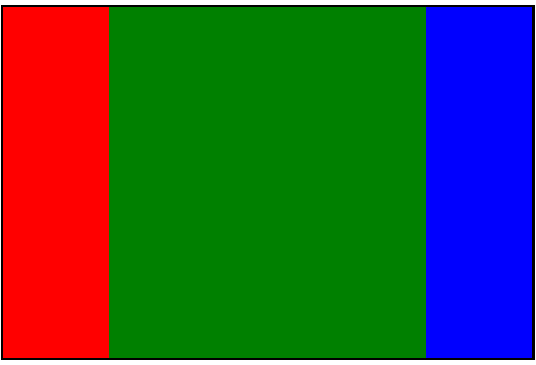

# HTML5与CSS3(五)

## 一、布局

### 1.浮动布局

**布局效果**：

​		头部区域自适应

​		尾部区域自适应

​		中间区域宽度固定	


包含两个固定宽度的模块，并且并列渲染，两个盒子，一个浮动，一个在文档流上中间的内容区域自适应（例如：80%居中）此时页面小于内容区域最小盒子宽度的时候，头部和尾部显示不全了，我们可以让页面的最小宽度不小于该宽度即可

min-width:设置最小宽度

min-height:设置最小高度

max-width:设置最大宽度

max-height:设置最大高度

[浮动布局案例](../code/14.HTML5与CSS3(五)/1.浮动布局.html)

### 2.列表布局

模型：在一个固定宽度的盒子内，均匀放置盒子，使他们之间的边距一致

特点：盒子的宽度是一样的，盒子之间的边距是一样的

布局公式：容器的宽度w,盒子的宽度是iw,边距是m,放置盒子的数量n

```html
w = n*iw + (n-1)*m
```

根据这个公式，如果三个变量是已知的，我们可以求第四个变量


注意，布局的时候，每个盒子都要设置右边距，此时容器应该比原有的宽度多出一个边距来，我们可以通过修改margin来解决（在没有显性设置宽度的时候，我们可以通过margin修改容器的宽度）

[列表布局案例](../code/14.HTML5与CSS3(五)/2.列表布局.html)

### 3.两翼齐飞(双飞翼)布局

两翼齐飞又叫双飞翼布局，是一个三列布局，中间自适应宽度，两翼固定宽度的一种布局模型

经典布局方案：

1.三个容器排在一起，所以我们可以使用浮动布局

2.中间的自适应，我们可以让其占一整行，然后让子元素通过margin居中来自适应

3.后面橘黄色的元素，要放在最前面，移动了是绿色元素父容器的宽度，向左平移，所以设置负值

4.后面蓝色的元素，要放在最后面，根据浮动贴边特性，只需要向前移动蓝色盒子的宽度即可


[双飞翼布局案例](../code/14.HTML5与CSS3(五)/3.双飞翼布局.html)

### 4.固比固布局：

就是中间自适应，左右固定，所以可以并列三个元素，前面两个脱离文档流（浮动）一左一右，设置固定宽度即可


[固比固布局案例](../code/14.HTML5与CSS3(五)/4.固比固布局.html)

### 5.圣杯布局-自适应等高布局（table）

模型，三列(多列)等高，宽度自适应

特点：

1.他们三个在一行，因此要浮动布局

2.他们宽度自适应，因此用百分比设置宽度

3.他们可能有不同的高度（可以手动设置）

4.浮动布局，让父元素具有高度，我们要设置overflow(清除浮动)，一旦父元素设置overflow，从最大高度开始截取

5.为了弥补高度差，我们要填充高度，我们设置padding-bottom可以让盒子增高，我们设置margin-bottom负值，可以降低高度，综合使用他们即可弥补高度差，所以设置margin-bottom和padding-bottom要足够大：最大高度-最小高度

增加多少，降低多少，高度维持不变



[圣杯布局案例](../code/14.HTML5与CSS3(五)/5.圣杯布局.html)

### 6.视口

分辨率：就是屏幕的像素的数量，比如1600*900，指的是横向有1600的像素点，纵向有900个像素点。所谓的像素点是物理元件最小的发光单位。

#### 6.1.视口宽度

我们可以通过JS语句来获取浏览器的宽度：document.documentElement.clientWidth;

自定义移动设备的视口宽度。可以用meta标签，来设置视口的宽度：

\<meta name="viewport" content="width=300"/>

一旦设置了，浏览器此时就会认为自己的宽度是300px。此时就会按照300px来渲染页面。

viewport太好用了，通过该属性据可以修改视口宽度了，我们发现：不同的视口大小，呈递相同的页面，给人的感觉是不一样的，尤其是看文字，h1的默认字号32px。如果你的视口是980px,此时看文字非常小。如果是320左右，此时刚刚好

此时就有一个换算关系，如果让一个300px的盒子，在电脑上看，和在手机上看的物理长度一样，就是我们用尺子量，结果一样宽

#### 6.2.缩放因子DPR(设备像素比)

DPR(DevicePixedRatio):手机的物理像素与实际使用像素的缩放比，早期的iPhone3GS的屏幕分辨率是320*480，这时候的DPR是1.IOS绘制图形（CGPoint/CGSize/CGRect）均以point为单位：1point=1pixel后来的Iphone4中同样大小的（3.5inch）的屏幕采用Retina(视网膜)屏幕显示技术（同样的尺寸，像素多了一倍），横纵方向像素密度都被放大到2倍，像素分辨率提高到(320\*2)\*(480\*2)=640\*960,像素率提高到iPhone3GS的4倍

DPR的计算公式：DPR=单位长度(pixel/point);如iPhone6中的scale值=750px/375pt=2.0

所以任何手机如果想要有显示和计算机一样的宽度，就要根据自己的分辨率、DPR的不同，而设置不同的视口。如果我们加上：

\<meta name="viewport" content="width=device-width"/>

此时每个手机的视口宽度，都是"视口约束宽度"。

每个手机的视口约束宽度是不一样，这就是为了给人看上去物理感觉是一样的：

各个设备约束视口之后的视口宽度（300-420）

你会发现这个宽度都是不一样，但是此时人看上去的感觉是一样的。字号也是 一样大的

#### 6.3.viewport

开发手机页面的时候，一定要加上：

\<meta name="viewport" content="width=device-width,initial-scale=1.0,minimum-scale=1.0,maximum-scale=1.0,user-scalable=no" id="viewport"/>

width=device-width：约束视口

initial-scale=1.0：初始视口倍数是1倍

minimum-scale=1.0：最小允许视口宽度是1倍

maximum-scale=1.0：最大允许视口宽度是1倍

user-scalable=no：不允许用户缩放视口

> 注意：
>
> 手机的视口约束之后都是320~420之间。而分辨率基本都是1000~1200，也就是说，约束视口之后，所谓的1px，实际上手机用了2点多个像素来渲染。手机上的图片，必须使用放大两倍的图片缩小使用，这样能够更加精细（不会导致图片放大之后失真）

[视口案例](../code/14.HTML5与CSS3(五)/6.视口.html)

### 7.百分比布局

百分比布局也叫流式布局

用百分比为单位，最重要的是，参考了谁，是谁的百分比？

width：参考的父盒子的width。

> 注意：是内容的宽度不算padding。如果没有父盒子，此时父盒子就是body,参考就是浏览器的页面宽度

height：参考的是父盒子的height

padding：参考的是复合的width

> 注意：无论哪个方向的padding都是参考的父盒子的width

margin：参考的父盒子的width

> 注意：无论哪个方向的margin都是参考的父盒子的width

border不能用%写，可以通过box-sizing来更改盒模型

如果是绝对定位：

子盒子的width：百分比参考的是距离最近，且有定位的父盒子的width（算上padding）

子盒子的height：百分比参考的是距离最近，且有定位的父盒子的height（算上padding）

子盒子的padding，margin：百分比参考的是距离最近，且有定位的父盒子的width（算上padding）

[百分比布局案例](../code/14.HTML5与CSS3(五)/7.百分比布局.html)