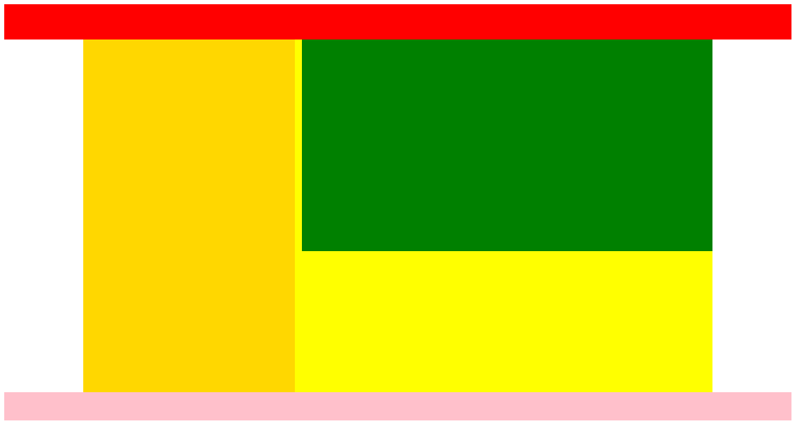
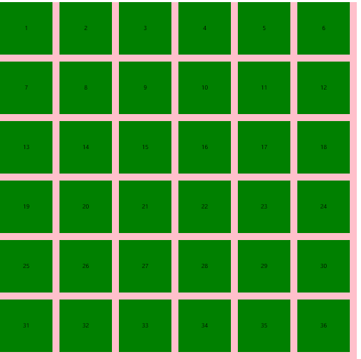

# HTML5与CSS3(五)

## 一、布局

### 1.浮动布局

**布局效果**：

​		头部区域自适应

​		尾部区域自适应

​		中间区域宽度固定	



包含两个固定宽度的模块，并且并列渲染，两个盒子，一个浮动，一个在文档流上中间的内容区域自适应（例如：80%居中）此时页面小于内容区域最小盒子宽度的时候，头部和尾部显示不全了，我们可以让页面的最小宽度不小于该宽度即可

min-width:设置最小宽度

min-height:设置最小高度

max-width:设置最大宽度

max-height:设置最大高度


### 2.列表布局

模型：在一个固定宽度的盒子内，均匀放置盒子，使他们之间的边距一致

特点：盒子的宽度是一样的，盒子之间的边距是一样的

布局公式：容器的宽度w,盒子的宽度是iw,边距是m,放置盒子的数量n

```html
w = n*iw + (n-1)*m
```

根据这个公式，如果三个变量是已知的，我们可以求第四个变量



注意，布局的时候，每个盒子都要设置右边距，此时容器应该比原有的宽度多出一个边距来，我们可以通过修改margin来解决（在没有显性设置宽度的时候，我们可以通过margin修改容器的宽度）

### 3.两翼齐飞(双飞翼)布局

两翼齐飞又叫双飞翼布局，是一个三列布局，中间自适应宽度，两翼固定宽度的一种布局模型

经典布局方案：

1.三个容器排在一起，所以我们可以使用浮动布局

2.中间的自适应，我们可以让其占一整行，然后让子元素通过margin居中来自适应

3.后面橘黄色的元素，要放在最前面，移动了是绿色元素父容器的宽度，向左平移，所以设置负值

4.后面蓝色的元素，要放在最后面，根据浮动贴边特性，只需要向前移动蓝色盒子的宽度即可


### 4.固比固布局：

就是中间自适应，左右固定，所以可以并列三个元素，前面两个脱离文档流（浮动）一左一右，设置固定宽度即可


