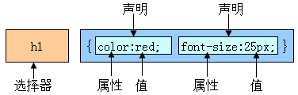

# CSS基础知识（一）
css介绍
- CSS 指层叠样式表 (Cascading Style Sheets)
- CSS通常称为CSS样式表或层叠样式表（级联样式表），主要用**于设置HTML页面中的文本内容（字体、大小、对齐方式等）、图片的外形（宽高、边框样式、边距等）以及版面的布局等外观显示样式。**
- CSS以HTML为基础，提供了丰富的功能，如字体、颜色、背景的控制及整体排版等，而且还可以针对不同的浏览器设置不同的样式。
- CSS就是控制页面布局和样式


## 1.HTML、CSS、JavaScript关系

|名称|层级|功能|
|:---:|:---:|:---:|
|HTML|结构层|负责从语义的角度搭建页面结构|
|CSS|样式层|负责从审美的角度美化页|
|JavaScript|行为层|负责从交互的角度提升用户体验|


## 2.css语法

选择器:是一个选择谁（标签）的过程。

选择器位置：
```HTML
<head>
  <meta charset="utf-8">
  <title>标签选择器学习</title>
  <style type="text/css">
    div{
      样式表内容
    }
  </style>
</head>
```

结构:
>选择器{属性:值;属性:值...}



|属性|解释|
|:---:|:---:|
|Width:20px;|	宽|
|Height:20px;|	高|
|Background-color:red;|	背景颜色|
|font-size:24px;	|文字大小|
|text-align:left \| center\| right	|内容的水平对齐方式|
|text-indent:2em;	|首行缩进|
|Color:red;	|文字颜色|

**一个em相当于两个文字**

### 颜色的显示方式：
- 直接写颜色的名称
```
/* 直接写颜色 */
color:pink;
```
- 十六进制显示颜色
  0-9  a-f
  000000; 前2为代表红色，中间2位代表绿色，后边2位代表蓝色。
```
/* 16进制显示颜色 */
color: #2f1c2b;
```
- rgb
```
/* rgb显示颜色 */
color: rgb(45, 82, 213);
```
- rgba
```
/* rgba加透明度显示颜色 */
color: rgba(255, 0, 0, 0.5);
```


## 3.选择器

### 3.1 基础选择器

#### ◆标签选择器
会选择页面所有标签
>结构：
标签{属性:值}

```HTML
    <style type="text/css">
      div{
        font-size:50px;
        color:green;
        background-color:yellow;
        width:300px;
        height:200px;
      }
      p{
        color:pink;
        font-size:30px;
      }
    </style>
```

#### ◆类选择器（重点）
只会生效在对应的类名的标签
>结构：
.自定义类名{属性:值;  属性:值；}

```HTML
<html lang="en" dir="ltr">
  <head>
    <meta charset="utf-8">
    <title></title>
    <style type="text/css">
        .box{
          font-size: 40px;
          color:rgb(159, 87, 152);
          width: 400px;
          height: 300px;
          background-color: rgb(125, 125, 13);
        }
        .miss{
          text-align: right;
          text-indent: 2em;
        }
    </style>
  </head>
  <body>
      <div class="box miss">
        前端
      </div>
      <div>
        前端学习
      </div>
      <p class="box">
        自学前端
      </p>
  </body>
</html>
```
**特点**
- 谁调用，谁生效。
- 一个标签可以调用多个类选择器。
- 多个标签可以调用同一个类选择器。

**★类选择器命名规则**
- ◎不能用纯数字或者数字开头来定义类名
- ◎不能使用特殊符号或者特殊符号开头（\_）来定义类名
- ◎不建议使用汉字来定义类名
- ◎不推荐使用属性或者属性的值来定义类名

**常用的命名**
| 名称 | 英文     |
| :------------- | :------------- |
|头|header |
|内容|content/container|
|尾 |footer|
|导航|nav  |
|侧栏|sidebar|
|栏目|column|
|页面外围控制整体布局宽度|wrapper|
|左右中|left right center|
|登录条|loginbar|
|标志|logo|
|广告|banner|
|页面主体|main|
|热点|hot|
|新闻|news|
|下载|download|
|子导航|subnav|
|菜单|menu|
|子菜单|submenu|
|搜索|search|
|友情链接|friendlink|
|页脚|footer|
|版权|copyright|
|滚动|scroll|
|内容|content|

**注意：**

>多个类选择器用同一个标签从下到上作用

#### ◆ID选择器

只会生效在对应的类名
>结构：
\#自定义名称{属性:值;}

```HTML
<!DOCTYPE html>
<html lang="en" dir="ltr">
  <head>
    <meta charset="utf-8">
    <title></title>
    <style type="text/css">
      #box{
        font-size:14px;
        color:rgb(201, 159, 90);
        width:100px;
        height:200px;
        background-color:#ed1d18;
      }
      .miss{
        text-align: right;
        text-indent: 2em;
      }
    </style>
  </head>
  <body>
    <div id="box" class="miss">
      前端
    </div>
    <div >
      学习前端
    </div>
    <p class="miss">自学前端</p>
  </body>
</html>
```
**特点**
- 一个ID选择器在一个页面只能调用一次。如果使用2次或者2次以上，不符合w3c规范，JS调用会出问题。
- 一个标签只能调用一个ID选择器。
- 一个标签可以同时调用类选择器和ID选择器。

#### ◆通配符选择器

会给所有标签都使用上同样的样式
> 结构：
\*{属性:值;}

```HTML
<html lang="en" dir="ltr">
  <head>
    <meta charset="utf-8">
    <title></title>
    <style type="text/css">
      *{
        font-size:30px;
        color:rgb(164, 136, 179);
        width:200px;
        height:300px;
        text-align:center;
        text-indent:2em;
      }
    </style>
  </head>
  <body>
    <div class="box">
      前端学习
    </div>
    <p id="miss">前端</p>
    <div class="nav">
      自学前端
    </div>
  </body>
</html>
```
**特点**
- 给所有的标签都使用相同的样式。

**注意**
不推荐使用，增加浏览器和服务器负担。
### ID选择器与类选择器的区别
- 1：类选择器 ：  好比人的名字          刘德华     可以多人使用
- 2：id 选择器     好比人的身份证     唯一性     有且只能使用一次
- 3：不同于类选择器，ID 选择器不能结合使用

**推荐**
>写样式的时候，大部分都是用类，极少的使用id。 不提倡用id 去写样式，因为他的权重太高。 Id 主要是为了 js 做准备。


### 3.2 复合选择器

复合选择器是由两个或多个基础选择器，通过不同的方式组合而成的，
#### ◆交集选择器

即要满足使用了某个标签，还要满足使用了类（id）选择器。

>结构:
标签+类（ID）选择器{属性：值；}

```HTML
<html lang="en" dir="ltr">
  <head>
    <meta charset="utf-8">
    <title></title>
    <style type="text/css">
      .box{
        font-size:50px;
      }
      div.box{
        color:red;
      }
      div#miss{
        width:400px;
        height:300px;
        background-color:yellow;
      }
    </style>
  </head>
  <body>
    <div class="box">
      前端学习
    </div>
    <p class="box">前端</p>
    <div id="miss">
      自学前端
    </div>
  </body>
</html>
```
**特点：即要满足使用了某个标签，还要满足使用了类（id）选择器**

#### ◆后代选择器（重点）
后代选择器首选要满足包含（嵌套）关系。
父集元素在前边，子集元素在后边。

>结构：选择器+空格+选择器{属性：值;}
```HTML
<!DOCTYPE html>
<html lang="en" dir="ltr">
  <head>
    <meta charset="utf-8">
    <title></title>
    <style media="screen" type="text/css">
        .box{
          font-size:40px;
          color:#16add4;
        }
        div span{
          font-size:400px;
        }
        .box span{
          background-color:rgb(207, 76, 30);
        }
        .box .miss{
          color:rgb(67, 5, 237);
        }
    </style>
  </head>
  <body>
    <div class="box">
      <p><span class="miss">前端学习</span></p>
    </div>
    <div class="box">
      <span>自学前端</span>
    </div>
  </body>
</html>
```

**特点：**
- 无限制隔代。
- 只要能代表标签，标签、类选择器、ID选择器自由组合。

#### ◆子代选择器
选中直接下一代元素。

>结构：选择器>选择器{属性:值;}
```HTML
<html lang="en" dir="ltr">
  <head>
    <meta charset="utf-8">
    <title></title>
    <style media="screen" type="text/css">
        div>span{
          font-size:40px;
          color:red;
        }
        p>span{
          font-size:100px;
          Color:green;
        }
    </style>
  </head>
  <body>
    <div class="box">
      <p><span>前端学习</span></p>
      <span>前端学习</span>
    </div>
  </body>
</html>

```

#### ◆并集选择器
>结构：
选择器+，+选择器+，选择器{属性:值;}

```HTML
<html lang="en" dir="ltr">
  <head>
    <meta charset="utf-8">
    <title></title>
    <style media="screen" type="text/css">
      .box,#miss,span,h1{
        font-size:100px;
        color:#fff;
        background-color:green;
      }
    </style>
  </head>
  <body>
    <div class="box">前端</div>
    <p id="miss">学习前端</p>
    <span>自学前端</span>
    <h1>哈哈</h1>
  </body>
</html>
```
### 3.3 文本元素
#### 属性：
- font-size:16px;  文字大小
- Font-weight: 700	;   值从100-900，文字粗细，不推荐使用font-weight:bold;
- Font-family:微软雅黑;  文本的字体
- Font-style: normal | italic;      normal 默认值  italic  斜体
- line-height: 行高

| 属性    | 值     |作用|
| :------------- | :------------- |:------------- |
|Text-align|	Center,left,right	|文字居中格式|
|Font-size	|18px	|设置文字大小|
|Font-family|	微软雅黑,宋体|	设置字体|
|Font-weight	|Normal默认，bold粗体，100px|设置字体加粗|
|Font-style	|Normal默认，italic斜体|	设置字体风格|
|Color|	颜色|	设置文字颜色|

字体表：
|字体名称|英文名称|	Unicode 编码|
|:---:|:---:|:---|
|宋体|	SimSun|	\5B8B\4F53|
|新宋体|	NSimSun	|\65B0\5B8B\4F53|
|黑体	|SimHei|	\9ED1\4F53|
|微软雅黑 |microsoft yahei|	\5FAE\8F6F\96C5\9ED1|
|楷体_GB2312|	KaiTi_GB2312|	\6977\4F53_GB2312|
|隶书|	LiSu|	\96B6\4E66|
|幼园|	YouYuan	|\5E7C\5706|
|华文细黑|	STXihei	|\534E\6587\7EC6\9ED1|
|细明体|	MingLiU	|\7EC6\660E\4F53|
|新细明体|	PMingLiU|	\65B0\7EC6\660E\4F53|

#### 文本属性连写
>结构1：
font: font-style font-weight  font-size/line-height  font-family;

**注意：**
- font:后边写属性的值。一定按照书写顺序。
- 文本属性连写文字大小和字体为必写项。
>结构2:
Font:italic 700 16px/40px  微软雅黑;
