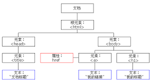

# JavaScript基础(八)

## 一、定时器

**单次定时器：** 间隔一段时间后异步（脱离程序主线程单独执行不会堵塞后面程序的执行）

启动单次定时器：setTimeout 

清除单次定时器：clearTimeout

**循环定时器：** 每一段时间，函数自动执行一次

启动循环定时器：setInterval

清除循环定时器：clearInterval

**setTimeout 与setInterval的参数：**

第一个参数：每一段时间要做的事情书写在函数内部。可以是匿名函数或者函数名。

第二个参数：函数间隔多少时间。单位是ms。不用书写单位。

从第二个参数开始，表示传递给第一个参数函数的数据。

定时器调用对象是window。但是一般不用书写window。表示加载之后立即调用定时器。

**clearTimeout与clearInterval的参数：**

定时器的名字

重新开启循环定时器时，一定要清除原有定时器，否则会造成定时器叠加。

## 二、DOM基础

我们前面学习的都是js语言的核心部分，也是ECMAScript。一般都是在控制台、输出语句里操作，JS还包括DOM和BOM。

DOM（Document Object Model， 文档对象模型）描绘了一个层次化的节点数，允许开发人员添加、移除和修改页面的某一部分。这使得JavaScript操作HTML，不是在操作字符串，而是在操作节点，极大地降低了编程难度。DOM对很多东西做了抽象，提供了丰富的api：取得元素、css样式、事件、运动、元素尺寸位置、节点操作等。

### 2.1.document对象

**document:** 表示文档（表示整个页面）对象。document对象具有页面几乎所有的方法或者属性。

读取：document.title页面的标题

赋值：使用=进行赋值

一般操作元素都是从获取元素开始的。

**获取元素的方法：**

**getElementById()方法：** 通过id属性获取元素对象

> 注意：
>
> 1.通过id属性得到的元素数据类型是对象
>
> 2.早期为元素添加id的时候，会在js中创建一个同名变量

**通过元素对象操作属性：**

读取：可以通过对象点方法得到属性名

设置：用=进行赋值

点语法只能读取或设置元素自带有的属性不能读取元素的自定义属性。

### 2.2.属性操作

**属性操作方法：**

**getAttubute()方法：** 可以读取元素自带属性或者自定义属性。

**setAttubute()方法：** 设置元素自带属性或者自定义属性。

**点语法和getAttubute(),setAttubute()方法区别：**

1.点语法只能获取或设置元素的自带属性，getAttubute(),setAttubute()方法可以读取元素自带属性或者自定义属性

2.点语法操作有些属性名需要改名字，getAttubute(),setAttubute()方法不用改名，是什么就书写什么。

class -->className、for-->htmlFor、rowspan-->rowSpan、colspan-->colSpan

3.style属性：通过点语法得到的是对象，而getAttubute()得到的是字符串。

4.点语法得到的style对象可以继续打点。而getAttubute()得到的是字符串不能继续打点调用

> 总结：

