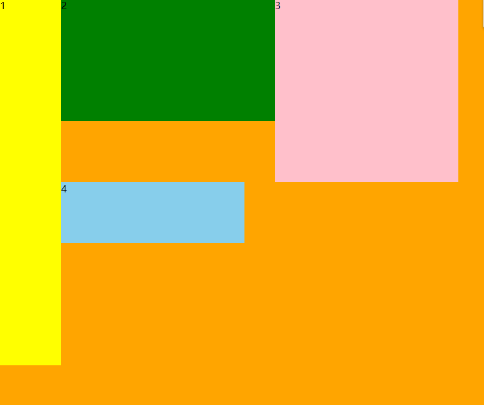

# CSS基础知识（四）

## 一.浮动

### 1.浮动

浮动模型：不同于标准流，元素挨着元素进行排列；

浮动的元素都脱离了标准文档流，不在占有原来的位置。

浮动出现的初衷是为了解决文字环绕的效果:**内容让出浮动部分，但是元素没有让出**；

属性float可以设置元素浮动效果，浮动效果有

left：左浮动

right：右浮动

none：默认不浮动（标准流）

[浮动示例](../code/6.CSS基础(四)/1.浮动.html)

### 2.浮动特征

1.浮动可以使元素从左到右紧密排列；

2.浮动的元素具有块级元素的特点(可以设置宽高，margin，padding生效，但是没有换行符)；

3.浮动后的元素不存在上下外边距合并问题；

4.浮动元素脱离了标准文档流，不再占有原有的位置；

5.一个元素设置浮动之后，其他同级元素通常都要设置为浮动；

6.元素设置浮动后，原有的自适应占父元素的百分之百宽度变为包裹内容的宽度；

7.元素设置浮动后，会影响后面元素的布局，所以设置浮动后一定要及时清除；

清除浮动的属性 clear:left|right|both(常用)；

[浮动特征示例](../code/6.CSS基础(四)/2.浮动特征.html)

### 3.浮动的元素塌陷问题

在父元素不设置宽高的情况下，嵌套的子元素如果设置了浮动，会呈现父元素塌陷的效果。

解决方案：

#### 3.1.给父元素设置高度

这种方法在确定宽高的情况下，可以使用。但是很多时候，容器都是由内容撑起来的，所以根据内容的多少，不太好控制这个高度

[设置高度示例](../code/6.CSS基础(四)/3.浮动塌陷问题-1-设置高度.html)

#### 3.2.外墙法

在父元素的后面，设置父元素的同一级空元素（div）,设置清除浮动；这种方式需要添加过多的空元素，增加结构代码量；并且我们完全可以在后面那个同级父元素上直接清除浮动

[外墙法示例](../code/6.CSS基础(四)/4.浮动塌陷问题-2-外墙法.html)

#### 3.3.内墙法

在父元素内部后面，添加一个空的子元素（div）,设置清除浮动；问题同外墙法类似，但是解决了外墙法不能解决父元素塌陷的问题；相对于父元素设置高度的不确定性，这种方式直接内容撑起父元素的高度。

[内墙法示例](../code/6.CSS基础(四)/5.浮动塌陷问题-3-内墙法.html)

#### 3.4.父元素设置为浮动，后面元素清除浮动；

该方法会触发更多的问题

[父元素设置为浮动示例](../code/6.CSS基础(四)/6.浮动塌陷问题-4-父元素设置浮动.html)

#### 3.5.父元素设置为行内块元素

```css3
display:inline-block;
```

达不到想要的布局效果

[父元素设置行内快元素示例](../code/6.CSS基础(四)/7.浮动塌陷问题-5-设置为行内块元素.html)

#### 3.6.父元素设置overflow属性

属性值可以使用hidden、auto、scroll

overflow属性本身是用来解决内容溢出元素的处理方式：

hidden：代表溢出隐藏。

auto：溢出自适应（内容没有溢出是无滚动条，溢出后有滚动条。

scroll：内容不管溢不溢出，都会出现滚动条。

visible：默认值，溢出可见，不能解决父元素塌陷问题。

这种方法在需要内容溢出盒子显示时，可能会影响显示的效果。

[父元素设置overflow属性示例](../code/6.CSS基础(四)/8.浮动塌陷问题-6-父元素设置overflow.html)

## 二.伪元素

### 1.伪元素

伪元素用于创建一些不在文档树中的元素，并为其添加样式。比如说，我们可以通过:before来在元素前添加文本，并为这些文本添加样式。虽然用户可以看到这些文本，但是这些文本实际上不在文档树种。

CSS2.1中提供了两个伪元素

```css3
:before /*在元素前面插入文本*/
:after  /*在元素后面插入文本*/
```

> 注意：
>
> 伪元素必须设置content样式，否则伪元素不会生效

[伪元素示例](../code/6.CSS基础(四)/9.伪元素.html)

### 2.伪元素清除浮动

清除浮动的解决方法：

#### 2.1.通过伪元素清除浮动

将伪元素插入到容器元素的最后面，代替内墙法中插入的元素，并用伪元素清除浮动。

[伪元素清除浮动示例](../code/6.CSS基础(四)/10.浮动塌陷问题-7-伪元素.html)

#### 2.2.clearfix类

工作中，我们将清除浮动的功能呢封装在一个clearfix类中，这样为容器元素设置该类，就可以清除浮动。

[clearfix类清除浮动示例](../code/6.CSS基础(四)/11.浮动塌陷问题-8-clearfix类.html)

### 3.伪类

伪类用于当已有元素处于的某个状态，为其添加对应的样式，这个状态是根据用户行为而动态变化的。比如说，当用户鼠标悬停在指定的元素时，我们可以通过:hover来描述这个元素的状态。虽然他和普通的css类相似，可以为已有的元素添加样式，但是他只有处于dom树无法描述的状态下才能为元素添加样式，所以将其称之为伪类。

如：

```css3
:focus{样式:样式值}  /*获取焦点，表单控件中使用*/
```

[伪类示例](../code/6.CSS基础(四)/12.伪类.html)

### 4.伪类和伪元素

特点：

1.伪元素和伪类都不会出现在源文档或者文档树中

2.伪类允许出现在选择器的任何位置，而一个伪元素只能跟在选择器的最后一个简单选择器后面

3.伪元素名和伪类名都是大小写不敏感的，建议小写。

4.有些伪类是互斥的，而其它的可以同时用在一个元素上。

区别：

伪类的操作对象是文档树中已有的元素，而伪元素则创建一个文档树之外的元素

伪类是类，伪元素是元素，因此他们的权值是不同的。

[伪类和伪元素示例](../code/6.CSS基础(四)/13.伪元素和伪类.html)

### 5.a标签的伪类

a标签可以定义四个伪类：

link:初始状态；必须是第一次访问或者清除历史记录的访问

```css3
:link{样式:样式值;}
```

visited:访问后状态

```css3
:visited{样式:样式值;}
```

hover:鼠标悬停；鼠标滑过效果

```css3
:visited{样式:样式值;}:hover{}
```

active:激活状态

```css3
:visited{样式:样式值;}:active{}
```

上面四个使用顺序l-v-h-a(love hate 爱恨准则)

[a标签的伪类示例](../code/6.CSS基础(四)/14.a标签的伪类.html)

### 6.浮动元素依次贴边

默认盒子会按照序号排列，如果前面有兄弟元素，盒子将紧贴它的兄弟元素；如果没有，盒子将贴边，也就是说如果一行容不下该元素，该元素会自动进入下一行，找到能够容下它的位置，然后渲染。

如图：4号直接贴在1号上了，如果继续往下找，发现下一行能够容下它，他会渲染，即使上边有多余的空隙（能够容纳它），它也不会钻进去，所以说它受它前面一个元素的影响。



​		

> 注意：
>
> 行内块元素会另起一行

[浮动元素依次贴边示例](../code/6.CSS基础(四)/15.浮动元素依次贴边.html)

### 7.浮动与行内块元素

**浮动**：

使元素脱离文档流，按照指定的方向发生移动，遇到父级的边界或者相邻的浮动元素就会停下来

**行内块**：

它具有行内块元素和块元素两者的特点，可以实现对元素的有序排列。

**二者区别：**

1.两者主要区别在于当标签的高度不一致时，体现出的差异,如果高度不一致时候，

浮动的元素会改变排列的顺序**（贴边）**

行内块元素会按顺序排列，行内块元素**不会贴边**，会另起一行

2.浮动元素脱离文档流，不会抢占空间，而行内块元素会抢占空间。

### 8.margin对元素宽度的影响

如果块元素没有设置宽度，默认宽度就是父容器的宽度

**在没有设置盒子宽度的情况下，**修改margin会影响盒子的宽度

margin-left或者margin-right设置正值，盒子宽度减小

margin-left或者margin-right设置负值，盒子宽度增加

**如果盒子设置了宽度，** 不论如何更改margin-left或者margin-right，盒子的宽度都不会改变，但是位置变化了，并且margin-left改变位置的优先级要高于margin-right改变位置的优先级(可以通过父容器的html属性align来更改优先级)

[margin对元素宽度的影响示例](../code/6.CSS基础(四)/16.margin对元素宽度的影响.html)

### 9.margin对浮动元素影响

对于标准文档流来说，块元素占满整行，因此设置它的水平方向margin，不会影响后面的元素margin是相对于原有位置移动的

如果让盒子浮动，此时盒子设置边距会影响后面的元素，前面元素位置不受影响（浮动元素贴边的特性）

#### 情况1.

如果浮动的盒子通过margin移动，是受前面元素影响的，那么盒子移动的距离就是前面所有盒子移动的距离

[margin对浮动元素的影响-情况一示例](../code/6.CSS基础(四)/17.margin对浮动元素的影响-情况一.html)

>box3移动的距离 = box1移动的距离 + box2移动的距离 + 自身移动的距离

#### 情况2.

如果将盒子2移动到盒子1前面，移动的距离与盒子1移动的距离无关，与盒子1以及盒子2的宽度有关

[margin对浮动元素的影响-情况二示例](../code/6.CSS基础(四)/18.margin对浮动元素的影响-情况二.html)

>box2的移动距离 = box1的宽度 + box2 的宽度

#### 情况3.

当盒子2移动到盒子1前面，盒子3和盒子1都贴边了(盒子3没有设置边距，与盒子1相贴边)为盒子设置边距（-50px）时，这时盒子3移动的真实距离是：盒子1移动的距离+盒子2的宽度+盒子3移动的距离。

[margin对浮动元素的影响-情况三示例](../code/6.CSS基础(四)/19.margin对浮动元素的影响-情况三.html)

>box3移动距离 = box1移动的距离 + box2的宽度 + box3移动的距离

#### 情况4.

对情况2进行补充，如果盒子1移动的距离超出盒子1的宽度，此时盒子2移动（盒子1的宽度+盒子2的宽度）的时候，就不能保证始终在盒子1前面了。

[margin对浮动元素的影响-情况四示例](../code/6.CSS基础(四)/20.margin对浮动元素的影响-情况四.html)

>2贴容器，所以1与2没有关系，都是相对于容器边移动，可能会遮盖


